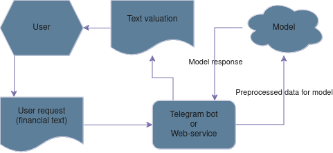

# Описание семестрового проекта по MLOps MIPT 2024

## Формулировка задачи

В данном проекте поставлена задача опромышлить и обернуть в репозиторий
инудстриального уровня модель глубокого машинного обучения.
Модель решает NLP-задачу - классификация статей/постов/заголовков 
из сферы финансов по характеру информации на "положительные" "негативные"
и "нейтральные".

Такая модель может значительно упростить чтение финансовых отчётов и новостей,
полных специфической терминологии и цифр, для человека, мало знакомого со сферой.

## Данные для моделирования

Предполагается использовать несколько (или все) из нижеперечисленных датасетов:

- [financial_phrasebank](https://huggingface.co/datasets/financial_phrasebank) - 4.85k строк
- [auditor_sentiment](https://huggingface.co/datasets/FinanceInc/auditor_sentiment) - 3.88k строк
- [twitter-financial-news-sentiment](https://huggingface.co/datasets/zeroshot/twitter-financial-news-sentiment) - 9.54k строк
- [kaggle-financial-sentiment](https://huggingface.co/datasets/chiapudding/kaggle-financial-sentiment?row=41) - 4.67k строк

Каждый из датасетов представляет собой таблицы с двумя столбцами: 

- Текст финансового поста или заголовок статьи 
- Метка класса ("positive", "negative", "neutral")

Эти данные хорошо подходят для решения поставленной задачи и обеспечивают
разнообразность выборки, т.к. тексты имеют
различные длину, структуру и стиль написания. В датасетах присутствуют короткие
посты пользователей соц.сетей (твиты, короткие высказывания из ленты и т.д.),
заголовки и аннотации статей, краткие выжимки из анализов и сводок. Стиль написания 
представленных текстов варьируется от экспертных и академических текстов до разговорной
речи в соц.сетях.

## Подход к моделированию

### Архитекруты
Реализовано несколько модельных решений данной задачи: 

- [DeBERTa, зафайнтюненная на вышеперечисленных датасетах](https://huggingface.co/RashidNLP/Finance-Sentiment-Classification)
- [FinBERT, зафайнтюненная только на датасете с твитами](https://huggingface.co/nickmuchi/finbert-tone-finetuned-fintwitter-classification)

Пока это первая итерация выбора моделей, возможно список будет изменён, в виду 
нехватки ресурсов для таких "жирных" моделей (требуются эксперименты)

### Обучение
Предполагается подготовть `.py`- скрипт для обучения модели, логгирования этого
процесса и сохранения контрольных точек во время обучения.

Основной инструмент для этого - `pytorch-lightning`, в который будет 
обёрнута модель. Запуск `.py`- скрипта предполагается осуществлять в контейнере,
где будут также располагаться данные для обучения, директории для чекпоинтов модели
и будут зафиксированы все версии используемых пакетов.

## Предсказания

Предполагается реализовать простой _user-friendly_ интерфейс (telegram-bot или
веб-приложение), с помощью которого пользователь сможет отправлять запрос и 
получать результат работы модели.

1. Пользователь отправляет интересующий его текст в бота/веб-сервис
2. Запрос перенаправляется на сервер, где развёрнута модель
3. Оценка модели, через "интерфейс-посредник" возвращается к пользователю

- Для реализации telegram-бота планируется использование инструмента `TeleBot`
- Реализация веб-сервиса возможна с помощью фреймворка `FastAPI`

